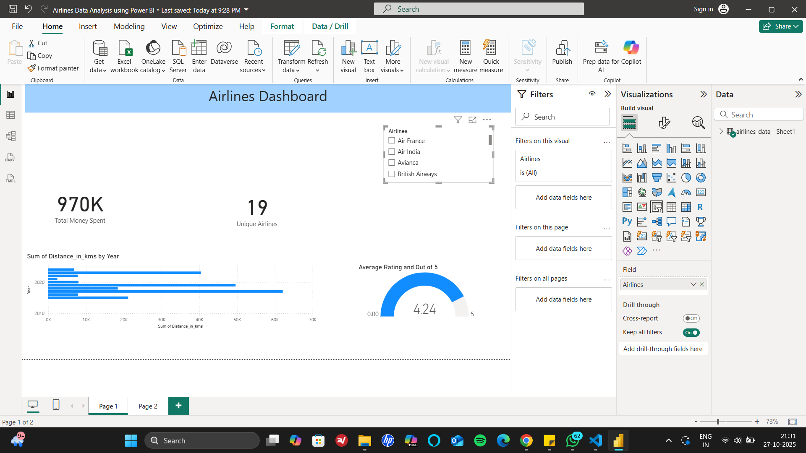

# 🧭 Travel Insights Dashboard - Power BI

## 📘 Overview
This Power BI project analyzes personal travel data to uncover insights on spending patterns, airline preferences, and flight statistics across continents.  
It demonstrates the use of DAX calculations, interactive slicers, and geospatial map visuals for storytelling through data.

## ⚙️ Key Features
- Interactive dashboard with filters for continent, airline, and year  
- KPIs such as total money spent, unique airlines, average rating, total flight hours, and distance per year  
- Map visuals showing destinations and flight routes  
- Data modeling and DAX measures for advanced analytics  

## 🧰 Tools & Technologies
- Power BI  
- DAX (Data Analysis Expressions)  
- Data Cleaning and Transformation  
- Visualization and Dashboard Design  

## 📸 Dashboard Preview
 

## 📁 Project File
- [Travel_Insights_Dashboard.pbix](AirlinesDataAnalysisusingPowerBI.pbix)

## 📊 Author
**Aadhya Dia**  
B.Tech (Hons.) CSE – IoT & Intelligent Systems  
LinkedIn: www.linkedin.com/in/aadhya-dia
